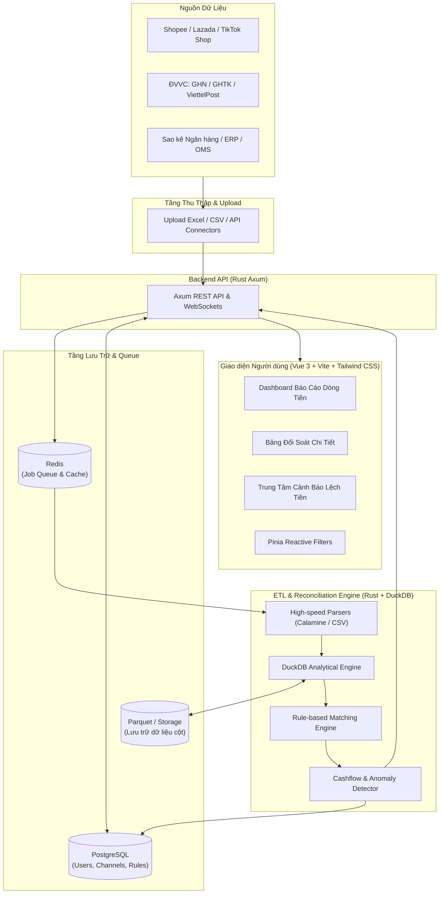

<div align="center">

# 📊 OmniRecon

### **Nền tảng Đối soát & Cảnh báo Dòng tiền cho Nhà bán hàng Đa kênh**
*Multi-channel E-Commerce Reconciliation & Real-time Cashflow Alert Platform*

[](LICENSE)
[](https://www.rust-lang.org/)
[](https://duckdb.org/)
[](https://vuejs.org/)
[](https://vitejs.dev/)
[](https://tailwindcss.com/)
[](https://www.postgresql.org/)
[](https://redis.io/)
[](https://www.docker.com/)

[Tính năng](#-tính-năng-cốt-lõi) •
[Kiến trúc](#-kiến-trúc-hệ-thống) •
[Cài đặt nhanh](#-cài-đặt-nhanh-quick-start) •
[Cấu trúc Source Code](#-cấu-trúc-source-code) •
[Tài liệu](#-tài-liệu-dự-án) •
[Đóng góp](#-đóng-góp-mã-nguồn) •
[Bản quyền](#-bản-quyền--giấy-phép)

---

</div>

## 💡 Giới thiệu

Trong kinh doanh thương mại điện tử đa kênh (Shopee, Lazada, TikTok Shop, Tiki) và bán hàng trực tiếp kết hợp các đơn vị vận chuyển (GHN, GHTK, Viettel Post, Ninja Van, J&T):
- **Hàng triệu giao dịch mỗi tháng** với hàng chục loại biểu phí (phí sàn, phí cố định, phí thanh toán, voucher trợ giá, phí vận chuyển vượt cân).
- **Thất thoát dòng tiền thầm lặng**: Tiền thu hộ COD bị lệch, đơn hàng hoàn trả nhưng vẫn bị trừ phí, sàn giữ tiền quá chu kỳ đối soát hoặc cấn trừ không rõ lý do.
- **Xử lý thủ công bằng Excel quá tải**: File bảng kê nặng hàng trăm MB làm treo máy tính, dễ sai sót công thức và mất nhiều ngày để phát hiện lệch tiền.

**OmniRecon** ra đời như một giải pháp mã nguồn mở tự lưu trữ (self-hosted), hiệu năng siêu tốc kết hợp sức mạnh phân tích OLAP của **DuckDB**, backend **Rust (Axum)** và giao diện Dashboard **Vue 3 + Tailwind CSS**.

---

## ✨ Tính năng Cốt lõi

- ⚡ **Công cụ Đối soát Siêu tốc (DuckDB + Rust)**:
  - Phân tích và so khớp hàng triệu dòng giao dịch chỉ trong vài giây.
  - Hỗ trợ nhập liệu đa định dạng: File báo cáo sao kê Excel (`.xlsx`, `.xls`), CSV, API tự động.
- 🔄 **So khớp Đa chiều (Multi-way Reconciliation)**:
  - **Sàn TMĐT vs Đơn hàng nội bộ (OMS/ERP)**: So khớp doanh thu, tiền thực nhận, phí dịch vụ.
  - **Đơn vị Vận chuyển (3PL) vs Tiền thu hộ COD**: Phát hiện đơn đã giao thành công nhưng chưa nhận đủ tiền COD.
  - **Sao kê Ngân hàng vs Phiên thanh toán sàn**: Đối soát dòng tiền thực tế đổ về tài khoản ngân hàng.
- 🚨 **Cảnh báo Lệch tiền & Bất thường Thời gian thực**:
  - Phát hiện phí sàn thu vượt mức biểu phí quy định.
  - Cảnh báo đơn giao thất bại / hoàn hàng phát sinh phí bất thường.
  - Cảnh báo dòng tiền âm hoặc chu kỳ tiền về chậm hơn SLA.
  - Bắn thông báo tức thì qua Telegram, Lark, Slack, Webhook.
- 📈 **Dashboard Báo cáo Trực quan (Vue 3 + Tailwind CSS + Pinia)**:
  - Biểu đồ biến động dòng tiền thực tế vs dòng tiền dự kiến (Cashflow Projection).
  - Phân tích cơ cấu chi phí sàn (tỷ lệ % phí trên doanh thu theo từng kênh).
  - Bộ lọc nâng cao đa tiêu chí theo thời gian, kênh bán, trạng thái đối soát.
- 🐳 **Triển khai 1 Lệnh Duy nhất (Self-hosted Docker Compose)**:
  - Đóng gói toàn bộ Nginx, PostgreSQL, Redis, Backend và Frontend sẵn sàng chạy mọi nơi.

---

## 🏗️ Kiến trúc Hệ thống



---

## 📂 Cấu trúc Source Code

```
omni-recon/
├── .github/                      # CI/CD Workflows
│   └── workflows/
│       └── ci.yml
├── backend/                      # Rust Monorepo Workspace
│   ├── Cargo.toml                # Workspace definition
│   ├── common/                   # Shared DTOs, Database Models, Errors
│   ├── engine/                   # DuckDB ETL & Reconciliation Core Engine
│   ├── server/                   # Axum REST API, WebSocket & Auth Handler
│   └── worker/                   # Async Task Consumer (Redis Queue)
├── frontend/                     # Vue 3 SPA Application
│   ├── src/
│   │   ├── components/           # Reusable UI components & charts
│   │   ├── stores/               # Pinia Stores (filters, recon, alerts, auth)
│   │   ├── views/                # Dashboard, Reconciliation, Alerts, Config
│   │   ├── router/               # Vue Router configuration
│   │   ├── App.vue
│   │   └── main.ts
│   ├── package.json
│   ├── vite.config.ts
│   └── tailwind.config.js
├── deploy/                       # Infrastructure & Deployment
│   ├── docker/
│   │   ├── Dockerfile.backend    # Rust multi-stage build
│   │   └── Dockerfile.frontend   # Node build + Nginx static server
│   ├── nginx/
│   │   └── default.conf          # Nginx Reverse Proxy config
│   └── sql/
│       ├── 01_init_schema.sql    # PostgreSQL initial DDL
│       └── 02_seed_data.sql      # Demo dataset
├── docs/                         # Tài liệu kỹ thuật chi tiết
│   ├── architecture.md           # Thiết kế kiến trúc tổng thể
│   ├── reconciliation-logic.md   # Quy tắc so khớp đối soát
│   ├── data-formats.md           # Đặc tả định dạng bảng kê sàn & ĐVVC
│   ├── alert-engine.md           # Cơ chế phát hiện lệch tiền
│   ├── api-spec.md               # Đặc tả REST & WebSocket API
│   └── deployment.md             # Hướng dẫn triển khai Production
├── docker-compose.yml            # Khởi chạy hệ thống toàn diện
├── docker-compose.dev.yml        # Môi trường phát triển cục bộ
├── .env.example                  # Mẫu biến môi trường
├── Makefile                      # Lệnh tiện ích (make dev, make build,...)
├── LICENSE                       # GNU Affero General Public License v3.0
├── NOTICE                        # Quy định bản quyền và đính kèm nguồn gốc
├── CONTRIBUTING.md               # Quy định đóng góp mã nguồn
└── README.md                     # Tài liệu tổng quan
```

---

## 🚀 Cài đặt Nhanh (Quick Start)

### Yêu cầu tiên quyết
- [Docker](https://docs.docker.com/get-docker/) & Docker Compose v2 trở lên.

### 1. Clone mã nguồn
```bash
git clone https://github.com/your-org/omni-recon.git
cd omni-recon
```

### 2. Cấu hình môi trường
```bash
cp .env.example .env
```

### 3. Khởi chạy toàn bộ hệ thống
```bash
docker compose up -d
```

Hệ thống sẽ tự động build và chạy các container:
- 🌐 **Web Dashboard & API Gateway**: `http://localhost` (hoặc cổng cấu hình)
- 🔌 **Backend REST API**: `http://localhost/api/v1`
- 📊 **PostgreSQL**: `localhost:5432`
- ⚡ **Redis**: `localhost:6379`

Tài khoản mặc định ban đầu:
- **Email**: `admin@omnirecon.local`
- **Mật khẩu**: `Admin@123456`

---

## 🛠️ Phát triển Cục bộ (Local Development)

### 1. Chạy dịch vụ phụ trợ (PostgreSQL & Redis)
```bash
docker compose -f docker-compose.dev.yml up -d
```

### 2. Chạy Backend (Rust)
```bash
cd backend
cargo run -p omni-server
```

### 3. Chạy Frontend (Vue 3)
```bash
cd frontend
npm install
npm run dev
```
Giao diện frontend phát triển chạy tại: `http://localhost:3000`

---

## 📖 Tài liệu Dự án

Tài liệu chi tiết được tổ chức tại thư mục [`docs/`](docs/):
- [Kiến trúc Hệ thống (`docs/architecture.md`)](docs/architecture.md)
- [Thuật toán & Quy tắc Đối soát (`docs/reconciliation-logic.md`)](docs/reconciliation-logic.md)
- [Quy chuẩn Định dạng Bảng kê (`docs/data-formats.md`)](docs/data-formats.md)
- [Cơ chế Cảnh báo Dòng tiền (`docs/alert-engine.md`)](docs/alert-engine.md)
- [Đặc tả REST / WebSocket API (`docs/api-spec.md`)](docs/api-spec.md)
- [Hướng dẫn Triển khai Self-hosted (`docs/deployment.md`)](docs/deployment.md)

---

## 🗺️ Lộ trình Phát triển (Roadmap)

- [x] Khởi tạo khung sườn Monorepo, Docker Compose, Database Schema ban đầu.
- [ ] Xây dựng Engine DuckDB so khớp sao kê Shopee, TikTok Shop, Lazada, GHN, GHTK.
- [ ] Hoàn thiện Dashboard Vue 3 + Tailwind CSS + Pinia với bộ lọc thời gian thực.
- [ ] Tích hợp Webhook kết nối thông báo Telegram, Lark, Slack.
- [ ] Hỗ trợ OpenID Connect (SSO) & Phân quyền đa người dùng (RBAC).
- [ ] Tích hợp AI phát hiện chi tiêu bất thường và dự báo dòng tiền tương lai.

---

## 🤝 Đóng góp Mã nguồn

Chúng tôi rất hoan nghênh sự đóng góp từ cộng đồng! Vui lòng đọc kỹ [CONTRIBUTING.md](CONTRIBUTING.md) để nắm quy chuẩn commit (Conventional Commits) và quy trình mở Pull Request.

---

## 📄 Bản quyền & Giấy phép (License & Attribution)

Dự án này được cấp phép theo giấy phép **GNU Affero General Public License v3.0 (AGPL-3.0)**. Xem chi tiết tại [LICENSE](LICENSE).

> **Lưu ý về Đính kèm Bản quyền (Attribution Notice)**:
> Mọi hành vi sử dụng lại, phân phối, sửa đổi hoặc triển khai dịch vụ dựa trên mã nguồn này đều **bắt buộc phải giữ nguyên tệp [NOTICE](NOTICE)**, ghi nhận đầy đủ quyền tác giả của dự án OmniRecon và công khai toàn bộ mã nguồn của phiên bản phái sinh theo điều khoản của AGPL-3.0.