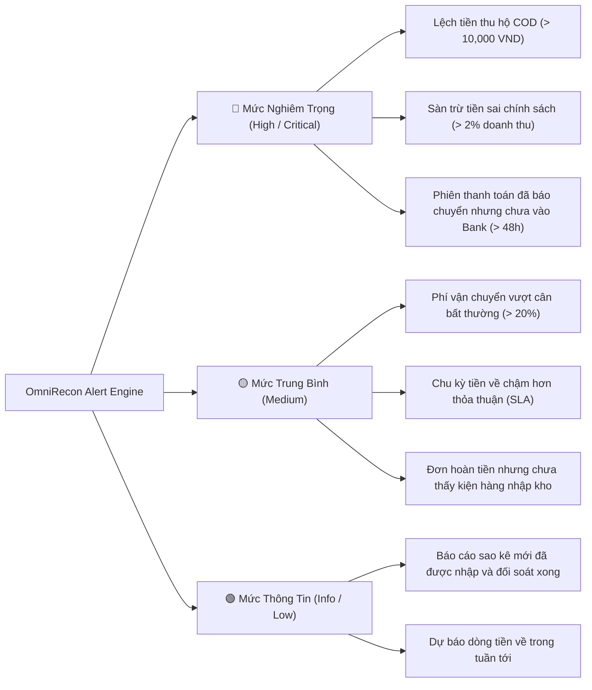

# 🚨 Cơ chế Cảnh báo Lệch tiền & Rủi ro Dòng tiền (Alert Engine)

Tài liệu này mô tả chi tiết logic phát hiện bất thường, phân loại mức độ nghiêm trọng và điều phối thông báo trong OmniRecon.

---

## 1. Các Loại Cảnh báo Bất thường (Anomaly Types)



---

## 2. Cấu hình Ngưỡng Cảnh báo (Alert Rules & Thresholds)

Người dùng có thể tùy chỉnh ngưỡng cảnh báo linh hoạt trong cơ sở dữ liệu (`alert_rules` table) hoặc thông qua giao diện Settings:

```json
{
  "rule_code": "COD_DISCREPANCY_RULE",
  "name": "Cảnh báo lệch tiền thu hộ COD",
  "channel_id": "all",
  "conditions": {
    "min_discrepancy_amount": 10000,
    "max_delay_days": 5
  },
  "severity": "CRITICAL",
  "notification_channels": ["TELEGRAM", "IN_APP"]
}
```

---

## 3. Kênh Thông báo Hỗ trợ (Notification Dispatchers)

1. **In-App Notification**: Hiển thị trên thanh chuông thông báo và mục Trung tâm Cảnh báo (`/alerts`).
2. **Telegram Bot**: Gửi tin nhắn tức thì kèm tóm tắt đơn hàng lệch tiền và nút bấm xem chi tiết.
3. **Slack / Lark (Feishu)**: Đẩy card thông báo có định dạng trực quan vào nhóm tài chính / kế toán.
4. **Webhook Tùy biến**: Tích hợp với hệ thống ERP/OMS nội bộ của doanh nghiệp.
