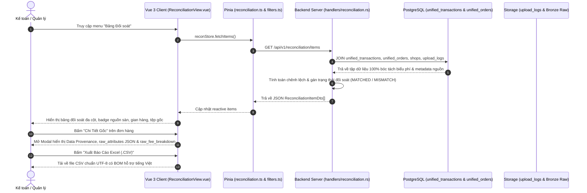

# Feature: Reconciliation Detailed Source Data

Tài liệu kỹ thuật mô tả tính năng hiển thị toàn bộ 100% dữ liệu đã ghi nhận & chuẩn hóa từ tệp bảng kê sao kê (Silver Layer) cùng nguồn gốc dữ liệu (Data Origin & Provenance Lineage) trên giao diện **Bảng Đối soát Chi tiết Đơn hàng**.

---

## 1. End-to-End System Flow

### Chi tiết luồng xử lý dữ liệu:
1. **Frontend Layer (Vue 3 + Pinia + TailwindCSS):**
   - [ReconciliationView.vue](file:///Users/tanhn/Projects/omni-recon/frontend/src/views/ReconciliationView.vue) kích hoạt `fetchItems()` khi khởi tạo.
   - Hỗ trợ 2 chế độ hiển thị: **Toàn Bộ Cột Chuẩn Hóa (Full View)** và **Thu Gọn (Compact View)**.
   - Hiển thị trực quan:
     - **Nguồn dữ liệu:** Nền tảng (Shopee, TikTok, Lazada, GHN...), Gian hàng, Tên tệp bảng kê gốc, Loại báo cáo nguồn.
     - **Định danh đơn hàng:** Mã đơn hàng, Mã vận đơn, Khách hàng, Thời gian hoàn thành, Trạng thái đơn sàn.
     - **Bóc tách dòng tiền chuẩn hóa:** Doanh thu gốc, Phí VC người mua, Trợ giá VC, Phí VC thực tế, Phí thanh toán, Phí cố định, Phí dịch vụ, Phí affiliate & khác, Tổng phí sàn, Thực nhận về.
     - **Kết quả đối soát:** Chênh lệch số học, Status Badge trực quan.
     - **Modal Raw Lineage:** Cho phép kiểm tra 100% các cột gốc (`raw_attributes`) và chi tiết phí gốc (`raw_fee_breakdown`) kèm nút sao chép JSON một chạm.
     - **Xuất CSV:** Kết xuất toàn bộ dữ liệu đã lọc ra định dạng CSV chuẩn UTF-8 kèm BOM.

2. **API & Business Logic Layer (Rust Axum):**
   - Endpoint: `GET /api/v1/reconciliation/items` trong [backend/server/src/handlers/reconciliation.rs](file:///Users/tanhn/Projects/omni-recon/backend/server/src/handlers/reconciliation.rs).
   - Truy vấn kết hợp (JOIN) 4 bảng dữ liệu cốt lõi: `unified_transactions`, `unified_orders`, `shops`, `upload_logs`.
   - Tính toán động tổng phí cấn trừ và độ lệch so với số tiền thực nhận (`discrepancy = actual_settlement - (gross_amount - total_fee)`).
   - Phân loại trạng thái đối soát: `MATCHED` (khớp 100%), `FEE_MISMATCH` (sai lệch biểu phí), `COD_MISMATCH` (đơn hoàn/lệch COD).

3. **Storage & Database Layer (PostgreSQL & Bronze Storage):**
   - Bảng `unified_transactions` lưu trữ số liệu tài chính chi tiết từng dòng đơn.
   - Bảng `unified_orders` lưu trữ trạng thái đơn, mã vận đơn và thuộc tính gốc `raw_attributes` (JSONB).
   - Bảng `upload_logs` lưu thông tin tệp bảng kê gốc (tên file, sha256 checksum, batch id).
   - Bảng `shops` lưu thông tin kênh và gian hàng liên kết.

---

## 2. Database & Schema Changes

- Tận dụng triệt để cấu trúc cơ sở dữ liệu Medallion Architecture đã thiết lập:
  - **`upload_logs`:** `id`, `platform`, `report_type`, `original_filename`, `file_path`, `created_at`.
  - **`shops`:** `id`, `code`, `name`, `platform`.
  - **`unified_orders`:** `id`, `shop_id`, `upload_log_id`, `platform_order_id`, `order_status`, `buyer_username`, `tracking_number`, `ordered_at`, `delivered_at`, `raw_attributes` (JSONB).
  - **`unified_transactions`:** `gross_amount`, `seller_discount`, `platform_voucher`, `buyer_shipping_fee`, `seller_shipping_fee`, `shipping_subsidy`, `commission_fee`, `service_fee`, `payment_fee`, `affiliate_commission_fee`, `other_fees`, `net_settlement`, `settled_at`, `raw_fee_breakdown` (JSONB).
- **Cải tiến tính toàn vẹn khóa ngoại:** Bổ sung cơ chế `RETURNING id` tại bước upsert `upload_logs` trong `statements.rs` nhằm đảm bảo tính toàn vẹn khóa ngoại `upload_log_id` giữa `upload_logs` và `unified_orders` / `unified_transactions` khi tải lại các tệp bảng kê đã tồn tại.

---

## 3. Technical Optimizations

1. **Truy vấn SQL tối ưu (Single-Query Join):**
   - Thay vì thực hiện nhiều truy vấn con (N+1 queries), toàn bộ dữ liệu tài chính, định danh đơn hàng, thông tin gian hàng và tệp bảng kê nguồn được nạp chỉ trong 1 truy vấn SQL kết hợp có sử dụng chỉ mục `btree` và `gin` index.
2. **Xử lý số học tài chính chính xác (Rust Decimal to Primitive):**
   - Sử dụng kiểu `rust_decimal::Decimal` trong tầng dữ liệu để tránh hiện tượng sai số dấu phẩy động (floating-point rounding errors) trong các phép cộng/trừ phí sàn và xác định chênh lệch đối soát.
3. **Hiển thị giao diện tối ưu (Vue 3 Computed & Sticky Header):**
   - Tối ưu hóa render bảng với `whitespace-nowrap`, thanh cuộn ngang mượt mà, sticky header với hiệu ứng `backdrop-blur-md` giúp người dùng dễ dàng theo dõi dòng tiền trên màn hình lớn.
4. **Xuất tệp CSV hỗ trợ tiếng Việt (UTF-8 BOM):**
   - Bổ sung tiền tố Byte Order Mark (`\uFEFF`) khi tạo blob CSV giúp Microsoft Excel trên Windows/macOS hiển thị tiếng Việt có dấu chuẩn xác 100% mà không bị lỗi font chữ.

---

## 4. Impacted Files

| Tệp tin | Trách nhiệm |
|---|---|
| [backend/server/src/handlers/reconciliation.rs](file:///Users/tanhn/Projects/omni-recon/backend/server/src/handlers/reconciliation.rs) | Cập nhật `ReconciliationItemDto` và mở rộng câu lệnh SQL JOIN đa bảng trả về đầy đủ các cột chuẩn hóa và thông tin nguồn gốc file. |
| [backend/server/src/handlers/statements.rs](file:///Users/tanhn/Projects/omni-recon/backend/server/src/handlers/statements.rs) | Đảm bảo tính nhất quán của `actual_upload_log_id` khi ghi nhận bảng kê vào cơ sở dữ liệu. |
| [frontend/src/types/index.ts](file:///Users/tanhn/Projects/omni-recon/frontend/src/types/index.ts) | Mở rộng kiểu dữ liệu `ReconciliationRow` đồng bộ với backend DTO. |
| [frontend/src/views/ReconciliationView.vue](file:///Users/tanhn/Projects/omni-recon/frontend/src/views/ReconciliationView.vue) | Thiết kế lại toàn diện giao diện bảng đối soát chi tiết: bổ sung đầy đủ các cột phí sàn, hiển thị nguồn tệp & gian hàng, modal xem thuộc tính gốc và xuất CSV. |
| [frontend/src/components/common/FilterBar.vue](file:///Users/tanhn/Projects/omni-recon/frontend/src/components/common/FilterBar.vue) | Cập nhật gợi ý tìm kiếm theo mã đơn, mã vận đơn, tên tệp nguồn và shop. |
